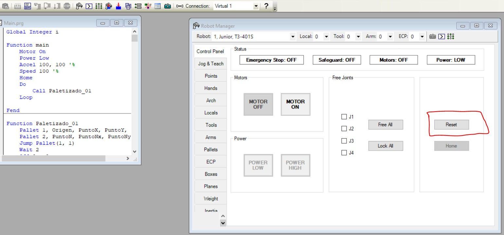
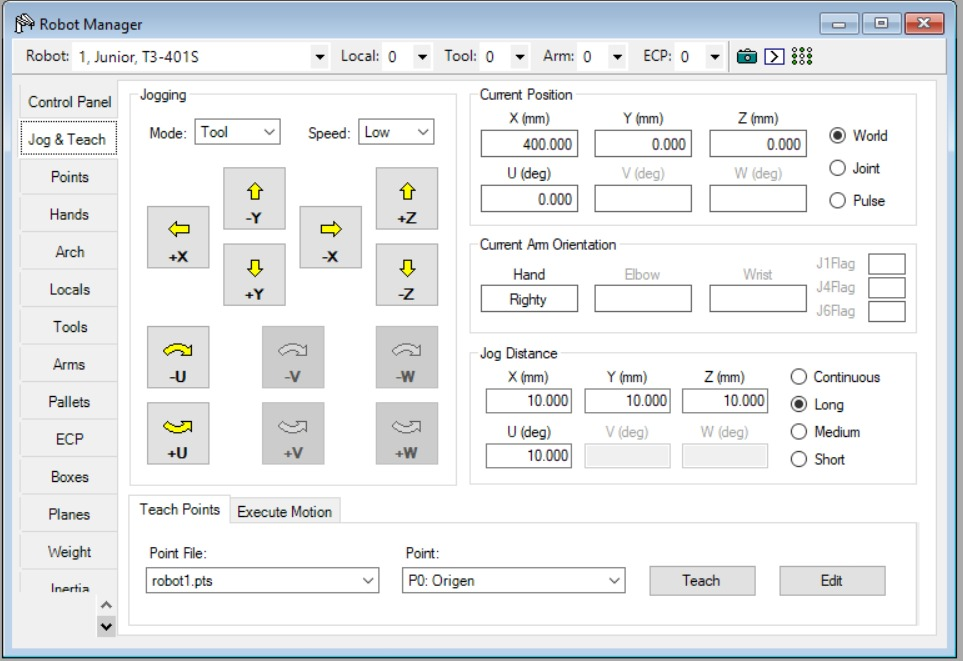
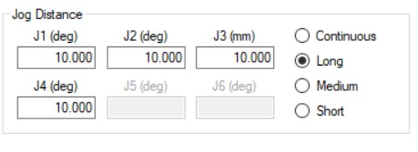

# Lab-03-Robotica-2025-2
Laboratorio 3 de Robótica 2025-2s, realizado por Jeison Diaz y Mateo Ramos

# Integrantes
1. Jeison Nicolás Diaz Arciniegas [jediazar@unal.co](JeisonD0819)
2. Mateo Ramos Cujer [mramoscu@unal.edu.co](MateoKGR)

# Informe

Indice:
1. [Cuadro comparativo](#cuadro-comparativo)
2. [Descripción de las configuraciones home](#descripcion-config)
3. [Procedimiento detallado](#procedimiento)
4. [Explicación completa](#explicacion)
5. [Descripción funcionalidades EPSON RC+ 7.0](#descripcion-funciones)
6. [Análisis comparativo EPSON RC+ 7.0, RoboDK y RobotStudio](#analisis)
7. [Diseño Gripper](#gripper)
8. [Diagrama de flujo](#diagrama)
9. [Plano de planta](#planos)
10. [Código desarrollado](#codigo)
11. [Videos](#videos)

## Cuadro comparativo

| Característica | **EPSON T3-401S** | **Motoman MH6** | **ABB IRB140** |
|----------------|--------------------|------------------|----------------|
| **Tipo de robot** | SCARA (4 ejes) | Articulado (6 ejes) | Articulado (6 ejes) |
| **Grados de libertad (DOF)** | 4 | 6 | 6 |
| **Carga máxima (Payload)** | 3 kg | 6 kg | 6 kg |
| **Alcance máximo** | 400 mm | 1373 mm | 810 mm |
| **Repetibilidad** | ±0.02 mm | ±0.08 mm | ±0.03 mm |
| **Velocidad máxima** | Hasta 4500 mm/s (ejes XY) | 230°/s (articulaciones) | 225°/s (articulaciones) |
| **Montaje** | De mesa (compacto) | En piso, pared o techo | En piso, pared o invertido |
| **Controlador** | EPSON RC+ 7.0 | NX100 / DX100 | IRC5 Compact |
| **Fuente de potencia** | 200–240 V CA monofásico | 200–230 V CA trifásico | 200–600 V CA trifásico |
| **Aplicaciones típicas** | Ensamble electrónico, empaque, pick and place | Soldadura, manipulación de piezas, paletizado | Ensamble, manipulación de materiales, mantenimiento de máquinas |
| **Peso del robot** | ~27 kg | ~130 kg | ~98 kg |
| **Ventajas principales** | Compacto, rápido, bajo costo y fácil de integrar | Alta carga, gran alcance, estructura robusta | Preciso, compacto, ideal para espacios reducidos |
| **Limitaciones** | Alcance corto, solo 4 ejes | Menor precisión que ABB | Mayor costo que Epson |
| **Software asociado** | EPSON RC+ 7.0 | MotoSim EG / NX100 | RobotStudio |
| **Comunicación con PC** | USB / Ethernet | Ethernet / RS-232 | Ethernet / USB |

## Descripción de las configuraciones home

Para este laboratorio definimos una configuración Home personalizada para el EPSON T3-401S, diferente a la que aparece por defecto cuando el robot inicia en EPSON RC+. La idea de esta configuración es sencilla: queríamos que el robot arrancara situado exactamente en la mitad del área de trabajo, con el brazo orientado hacia adelante, de manera que el alcance fuera simétrico hacia ambos lados. Por eso la articulación 1 se dejó a 90°, ya que esta orientación coloca el brazo principal alineado con el centro de la mesa, evitando que el robot empiece “sesgado” hacia un lado.

Una vez fijamos ese punto base, ajustamos las demás articulaciones para dejar el robot en una postura estable y segura: el eje vertical se ubicó a una altura que evitará cualquier colisión con la cubeta, y el eje de la herramienta se orientó recto, lo cual facilita el acople del gripper y las primeras aproximaciones a los palettes. Esta posición de Home se convirtió en la referencia de todo el trabajo del laboratorio: desde aquí se definieron los perfiles iniciales de los actuadores, el origen del palette de 30 posiciones (6×5) y la ubicación relativa de los dos huevos que se debían mover.

El Home también fue importante porque el patrón de movimiento exigía alternar entre dos palettes distintos y seguir un recorrido completo sin que las trayectorias se cruzaran. En nuestro caso, ambos palettes son realmente la misma matriz de 30 posiciones, solo que cada uno tiene un origen diferente: uno corresponde a la cubeta vista desde el huevo 1 y el otro desde el huevo 2. Para que todo funcionara de manera coherente, el robot necesitaba comenzar siempre desde un punto totalmente reproducible, y ese punto fue justamente la configuración Home.

Otro aspecto clave es que la lógica de la salida del vacío del robot está invertida: Out_9 en OFF significa agarrar, y Out_9 en ON significa soltar. Para evitar errores al comienzo de la secuencia, la postura de Home debía garantizar que la herramienta no estuviera demasiado cerca de la cubeta al momento de activar o desactivar el vacío. Al iniciar en Home y luego moverse a las posiciones del palette mediante los comandos Jump Pallet(#, posición), el robot siempre se desplaza primero a una altura segura antes de descender, lo que reduce riesgos en la manipulación del huevo.

Finalmente, esta configuración también mantiene coherencia con el código usado en la práctica. El programa arranca con Home, lo cual resetea la postura del robot a este punto inicial y asegura que toda la rutina Paletizado_01 funcione igual cada vez que se ejecuta. Desde ahí se van recorriendo las posiciones del palette en el orden requerido, alternando entre los dos huevos y controlando el vacío según el patrón del caballo. Toda la lógica del movimiento depende completamente de tener un Home consistente, de aquí que esta configuración fuera necesaria.

## Procedimiento detallado para realizar movimientos manuales
Para mover el robot manualmente desde EPSON RC+ 7.0 utilizamos la ventana de **Robot Manager**, que es donde se habilitan los motores, se desbloquean las articulaciones y se selecciona el modo de movimiento. El proceso es sencillo, pero debe hacerse en orden para que el robot acepte los comandos de jogging.

Lo primero es abrir Robot Manager y presionar el botón **Reset**. Esto limpia cualquier alarma o estado previo que impida mover el robot. Una vez el sistema está limpio, activamos los motores seleccionando **Motor ON**. Con esto, el robot queda listo para aceptar movimientos manuales.

A partir de aquí entramos a la pestaña **Jog & Teach**, que es la que permite moverlo articulado o cartesiano. En esta vista están los botones de traslación y rotación, junto con la posición actual del robot y el selector de modo. Para moverlo de manera articular, simplemente cambiamos el parámetro **Mode a Joint**; con esto, cada flecha corresponde al movimiento directo de una articulación. Si queremos moverlo en coordenadas cartesiana (X, Y, Z), entonces dejamos **Mode: Tool o Mode: World**, dependiendo de si queremos que los desplazamientos sigan el sistema de la herramienta o el del robot.

El movimiento lineal se hace con las flechas de **X, Y y Z**, mientras que las rotaciones se controlan con los botones **U, V y W**. En esta misma ventana podemos escoger la velocidad del jogging (Low, Medium o High) y la distancia de avance de cada pulsación. Con estas opciones ya es posible mover el robot libremente, registrar puntos y verificar las posiciones antes de programar.

## Explicación completa sobre los niveles de velocidad para movimientos manuales

Cuando se mueve el robot manualmente desde la ventana **Jog & Teach**, EPSON RC+ permite ajustar la velocidad a la que se desplaza cada vez que se presiona una flecha de movimiento. Esta velocidad no se ajusta directamente con un porcentaje, sino mediante los llamados niveles de **Jog Distance**, que definen qué tan grande es el desplazamiento o rotación que realizará el robot por cada comando. Esto afecta directamente la sensación de “velocidad” durante el jogging.

El panel donde se configuran estos niveles aparece en la sección llamada **Jog Distance**. Allí se pueden ver tres tamaños de paso: **Short, Medium y Long**, junto con la opción **Continuous**. En términos prácticos, cada vez que seleccionas uno de estos valores, el robot se mueve más despacio o más rápido según el tamaño del paso configurado.

En **Short**, los movimientos son pequeños y permiten ajustar la posición con precisión, útil cuando se está cercano a la cubeta o a un punto de enseñanza, en **Medium**, se obtiene un equilibrio entre precisión y velocidad, en **Long**, el robot se mueve con pasos amplios, lo cual se siente como mayor velocidad, ideal cuando hay que cubrir distancias largas dentro del área de trabajo.

Finalmente, **Continuous** mantiene el movimiento mientras se mantenga presionado el botón, en lugar de hacer desplazamientos discretos.

Justo encima de estas opciones también se pueden definir los valores numéricos de los pasos de X, Y, Z y U (rotación). Estos valores determinan cuántos milímetros o grados avanza el robot por pulsación. De esta forma, la velocidad percibida depende tanto del modo seleccionado (Short, Medium o Long) como del tamaño del paso configurado.

Para identificar cuál nivel de velocidad está activo o está establecido, hay que revisar cuál de los botones del panel **Jog Distance** está marcado. El botón seleccionado aparece resaltado y permanece activo mientras se realizan los movimientos manuales.

## Descripción funcionalidades EPSON RC+ 7.0
## Análisis comparativo EPSON RC+ 7.0, RoboDK y RobotStudio

EPSON RC+ 7.0 es el software oficial de programación y control de los robots EPSON. Está pensado para trabajar directamente con el manipulador real, nos permite definir trayectorias, rutinas y controlar entradas y salidas digitales desde una interfaz intuitiva. El punto más fuerte de EPSON RC+ es su comunicación directa con el robot T3-401S, ya que no requiere configuraciones externas ni licencias adicionales. Sin embargo, es un entorno más cerrado: solo funciona con robots EPSON y no ofrece tantas opciones de simulación avanzada como otras plataformas.

RoboDK, es un software más flexible y multiplataforma. Permite importar modelos de robots de diferentes marcas (ABB, KUKA, Fanuc, Yaskawa, etc.) y programarlos en un entorno 3D más visual. Facilita también la generación de código offline, lo que ayuda a probar trayectorias antes de implementarlas físicamente. Es ideal para simulaciones, análisis de alcance, tiempos de ciclo y programación sin depender del hardware, aunque la precisión de la simulación depende del modelo y la calibración.

RobotStudio, desarrollado por ABB, es a nuestro juicio el entorno más completo en términos de simulación. Está enfocado en la programación de robots ABB, ofreciendo herramientas de modelado, simulación de celdas completas y generación de código RAPID directamente compatible con los controladores IRC5. Su entorno es más pesado y técnico, pero también más robusto para proyectos de automatización real.

EPSON RC+ es bueno para la práctica directa con el manipulador EPSON T3-401S; RoboDK es el más versátil para comparar y probar diferentes marcas; y RobotStudio tiene una simulación más avanzada, aunque está cerrado al ecosistema ABB.

## Diseño técnico del gripper neumático
## Diagrama de flujo
## Plano de planta
## Código desarrollado
## Videos